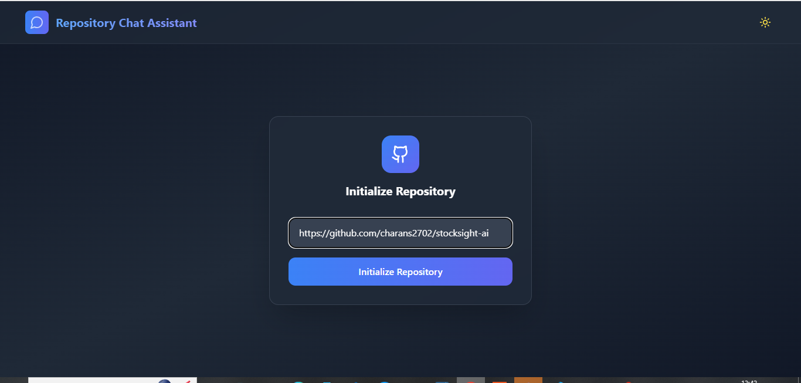

# Code Repository Analysis Chatbot

A full-stack application that allows users to analyze and chat about code repositories using Google's Generative AI and LangChain. The system clones GitHub repositories, processes the code files, and enables intelligent conversations about the codebase.

## Screenshots


*Repository Analysis Interface*


*Chat Interface with AI*

## Features

- Repository cloning and code analysis
- Intelligent code-aware chatbot using Google's Generative AI
- Vector database for efficient code search and retrieval
- FastAPI backend with RESTful endpoints
- React frontend for user interaction
- Support for Python, HTML, and CSS file analysis
- Conversation memory for contextual responses

## Application Workflow


## Architecture

### Backend Components

1. **Repository Handler** (`repo_handler.py`)
   - Manages Git repository cloning
   - Handles local repository storage

2. **Document Processor** (`document_processor.py`)
   - Processes code files using LangChain's document loaders
   - Supports Python, HTML, and CSS parsing
   - Implements intelligent text splitting for optimal processing

3. **Vector Database Manager** (`vector_database_manager.py`)
   - Manages Chroma vector database
   - Utilizes Google's Generative AI embeddings
   - Persists processed documents for quick retrieval

4. **Chatbot Handler** (`chatbot_handler.py`)
   - Implements conversation chain using LangChain
   - Maintains conversation memory for context
   - Uses Google's Gemini 1.5 Pro model for responses

### Frontend
- React-based user interface
- Located in `my-react-app` directory

## Setup

### Prerequisites

- Python 3.8+
- Node.js and npm
- Google Cloud API credentials
- Git

### Environment Variables

Create a `.env` file with the following variables:
```
GOOGLE_API_KEY=your_google_api_key
```

### Installation

1. Clone the repository:
```bash
git clone https://github.com/charans2702/Code-Repository-Analysis-Chatbot.git
cd Code-Repository-Analysis-Chatbot
```

2. Install backend dependencies:
```bash
pip install -r requirements.txt
```

3. Install frontend dependencies:
```bash
cd my-react-app
npm install
```

### Running the Application

1. Start the backend server:
```bash
uvicorn main:app --reload
```

2. Start the frontend development server:
```bash
cd my-react-app
npm run dev
```

## API Endpoints

### POST /initialize
Initializes a new repository for analysis
```json
{
    "repo_url": "https://github.com/username/repo"
}
```

### POST /chat
Sends a question to the chatbot
```json
{
    "question": "What does this repository do?"
}
```

### GET /status
Checks if a repository has been initialized
```json
{
    "initialized": true
}
```

## Technical Details

- Uses MMR (Maximum Marginal Relevance) for document retrieval
- Chunk size of 500 characters with 20 character overlap for document splitting
- Supports multiple programming language parsing
- Implements CORS middleware for cross-origin requests
- Uses Pydantic for request/response validation

## Dependencies

### Backend
- FastAPI
- LangChain
- Google Generative AI
- ChromaDB
- GitPython
- python-dotenv

### Frontend
- React
- Additional frontend dependencies (specified in package.json)

## Future Improvements

- Support for more programming languages
- Advanced code analysis features
- User authentication
- Repository caching
- Real-time collaboration

## Contributing

Contributions are welcome! Please feel free to submit a Pull Request.

## License

This project is licensed under the MIT License - see the LICENSE file for details.
